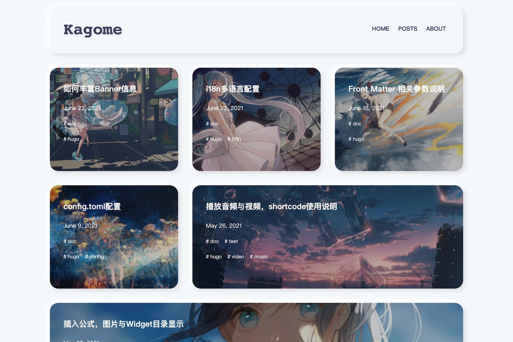

# kagome 一个卡片类拟态风格的Hugo主题



### Why is Kagome?

因为在开发这个主题的期间，一直在重温`犬夜叉`，真的很喜欢里面女主`日暮戈薇`，所以这里用了她的名字`kagome`～～

而站点域名则使用了`桔梗`的名字`kikyo` ~~我全都要~~

### Example Site

**[Example Site](https://kagome-example-site.vercel.app/)** | **[DEMO](https://kikyo.cc)**

### Document

doc list: [docs](https://kikyo.cc/posts/)

- [config.toml相关配置](https://kikyo.cc/posts/202106091132/)

- [Front Matter 相关参数说明](https://kikyo.cc/posts/202106180929/)

- [插入公式，图片与Widget目录显示](https://kikyo.cc/posts/202105251659/)

- [播放音频与视频，shortcode使用说明](https://kikyo.cc/posts/202105261132/)

- [i18n多语言配置](https://kikyo.cc/posts/202106221751/)

- [如何丰富Banner信息](https://kikyo.cc/posts/202106230952/)

### Install

#### 下载`kagome`

从GitHub下载主题并将其添加到网站目录: themes

进入你的网站目录并执行以下代码:

```
git clone https://github.com/miiiku/hugo-theme-kagome.git ./themes/kagome
```

或者你也可以将此存储库作为[Git - 子模块](https://git-scm.com/book/de/v2/Git-Tools-Submodule)，这样将更容易获取这个主题的更新

```
git submodule add https://github.com/miiiku/hugo-theme-kagome.git ./themes/kagome
```

如果你不是`git`用户也可以从[https://github.com/miiiku/hugo-theme-kagome/archive/refs/heads/main.zip](https://github.com/miiiku/hugo-theme-kagome/archive/refs/heads/main.zip)下载压缩包解压到你的网站目录下的`theme`文件夹下并重命名`hugo-theme-kagome-main`为`kagome`。

#### 应用当前主题为`kagome`

```base
echo theme = \"kagome\" >> config.toml
```

或者手动编辑`config.toml`文件找到**theme**并设置值为`kagome`
